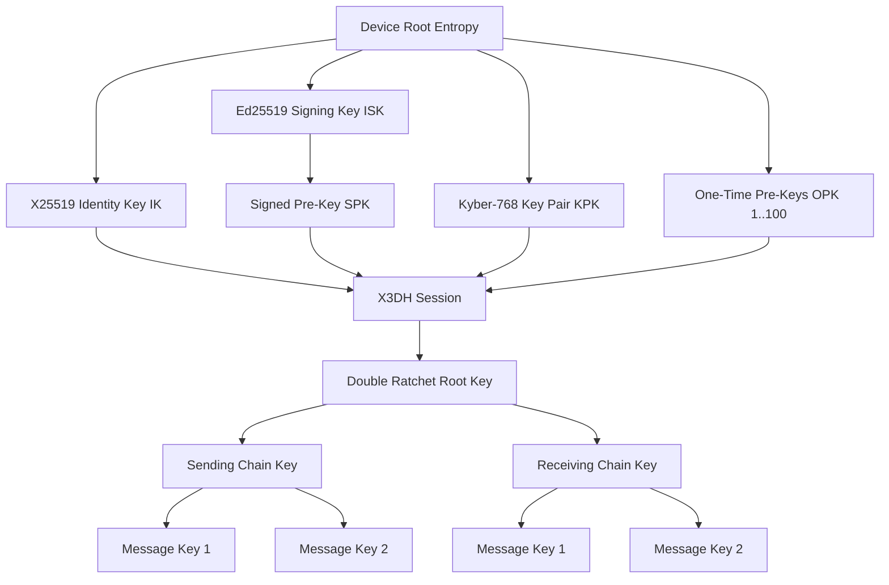

# Risaal Crypto Protocol Specification

**Version:** 1.0
**Status:** Stable
**Authors:** Risaal Project Contributors
**Last Updated:** 2026-04-06

## Table of Contents

1. [Overview](#1-overview)
2. [Notation](#2-notation)
3. [Key Types and Hierarchy](#3-key-types-and-hierarchy)
4. [X3DH Key Agreement](#4-x3dh-key-agreement)
5. [PQXDH: Post-Quantum X3DH](#5-pqxdh-post-quantum-x3dh)
6. [Double Ratchet Algorithm](#6-double-ratchet-algorithm)
7. [Sealed Sender](#7-sealed-sender)
8. [Sender Keys (Group Messaging)](#8-sender-keys-group-messaging)
9. [Safety Numbers](#9-safety-numbers)
10. [Message Padding](#10-message-padding)
11. [Steganography](#11-steganography)
12. [Secure Memory Management](#12-secure-memory-management)
13. [Session Auto-Reset](#13-session-auto-reset)
14. [Cryptographic Primitives](#14-cryptographic-primitives)
15. [Threat Model](#15-threat-model)
16. [Known Limitations and Future Work](#16-known-limitations-and-future-work)
17. [References](#17-references)

---

## 1. Overview

This document specifies the cryptographic protocol implemented by the `risaal_crypto` package, a military-grade end-to-end encryption library for the Risaal secure messenger. The protocol extends Signal's proven cryptographic primitives with post-quantum resistance (Kyber-768), metadata protection (Sealed Sender), and anti-forensics features.

### 1.1 Design Goals

1. **End-to-End Encryption**: Messages are encrypted on the sender's device and decrypted only on the recipient's device
2. **Forward Secrecy**: Compromise of long-term keys does not compromise past session keys
3. **Post-Compromise Security**: Sessions self-heal after key compromise through DH ratcheting
4. **Deniable Authentication (1-to-1)**: No cryptographic proof that a specific user sent a 1-to-1 message. Group messages use non-repudiable Ed25519 sender signatures for stronger authentication.
5. **Metadata Protection**: Server cannot determine message sender (Sealed Sender)
6. **Post-Quantum Resistance**: Hybrid X25519+Kyber-768 key agreement resists quantum attacks
7. **Anti-Traffic Analysis**: Uniform ciphertext sizes hide message content type
8. **Memory Safety**: Cryptographic material is securely zeroed after use

### 1.2 Protocol Layers

```
┌─────────────────────────────────────────────────────────────┐
│                     Application Layer                       │
├─────────────────────────────────────────────────────────────┤
│  Message Padding (Fixed Bucket Sizes: 256B - 256KB)        │
├─────────────────────────────────────────────────────────────┤
│  Sealed Sender (Metadata Hiding: Ephemeral X25519 + HKDF)  │
├─────────────────────────────────────────────────────────────┤
│  Double Ratchet (Forward Secrecy: X25519 DH + HKDF-SHA256) │
├─────────────────────────────────────────────────────────────┤
│  X3DH / PQXDH (Session Establishment: X25519 + Kyber-768)  │
├─────────────────────────────────────────────────────────────┤
│  Primitives (AES-256-GCM, HMAC-SHA256, Ed25519, SHA-512)   │
└─────────────────────────────────────────────────────────────┘
```

---

## 2. Notation

Throughout this document, we use the following notation:

| Symbol | Meaning |
|--------|---------|
| `IK_A` | Alice's identity key pair (X25519) |
| `IK_B` | Bob's identity key pair (X25519) |
| `ISK_A` | Alice's identity signing key pair (Ed25519) |
| `SPK_B` | Bob's signed pre-key (X25519) |
| `OPK_B` | Bob's one-time pre-key (X25519, ephemeral) |
| `EK_A` | Alice's ephemeral key pair (X25519) |
| `KPK_B` | Bob's Kyber pre-key (ML-KEM-768) |
| `DH(A, B)` | X25519 Diffie-Hellman between key pair A and public key B |
| `HKDF(IKM, info, salt)` | HKDF-SHA256 with 32-byte or 64-byte output |
| `HMAC(key, data)` | HMAC-SHA256 |
| `AES-GCM(key, plaintext)` | AES-256-GCM encryption |
| `AES-CBC(key, plaintext)` | AES-256-CBC encryption with PKCS7 padding |
| `Sign(sk, data)` | Ed25519 signature |
| `Verify(pk, data, sig)` | Ed25519 signature verification |
| `Encap(pk)` | Kyber-768 encapsulation, returns (ciphertext, shared_secret) |
| `Decap(sk, ct)` | Kyber-768 decapsulation, returns shared_secret |
| `\|\|` | Byte concatenation |
| `base64(data)` | Base64 encoding |

All byte arrays are serialized in big-endian format unless otherwise specified.

---

## 3. Key Types and Hierarchy

### 3.1 Identity Keys

**X25519 Identity Key Pair (IK)**
- **Purpose**: Long-term Diffie-Hellman key for X3DH and Sealed Sender
- **Algorithm**: Curve25519 ECDH
- **Lifetime**: Permanent (until device is wiped or user deletes account)
- **Storage**: Platform secure storage (iOS Keychain, Android EncryptedSharedPreferences)

**Ed25519 Identity Signing Key Pair (ISK)**
- **Purpose**: Sign pre-keys to prove authenticity
- **Algorithm**: EdDSA on Curve25519
- **Lifetime**: Permanent
- **Usage**: `signature = Sign(ISK_private, SPK_public)`

### 3.2 Pre-Keys

**Signed Pre-Key (SPK)**
- **Purpose**: Medium-term key for X3DH, signed by identity signing key
- **Algorithm**: X25519 key pair + Ed25519 signature
- **Lifetime**: 30 days (rotated periodically)
- **Wire Format**:
  ```json
  {
    "keyId": 42,
    "publicKey": "<base64 X25519 public>",
    "signature": "<base64 Ed25519 signature over publicKey>",
    "createdAt": "2026-04-06T12:00:00Z"
  }
  ```

**One-Time Pre-Key (OPK)**
- **Purpose**: Single-use ephemeral key consumed on first session
- **Algorithm**: X25519 key pair
- **Lifetime**: Single use (deleted after consumption)
- **Batch Size**: 100 keys generated per upload

**Kyber Pre-Key (KPK)**
- **Purpose**: Post-quantum key encapsulation (ML-KEM-768)
- **Algorithm**: NIST FIPS 203 Module-Lattice-Based KEM (Kyber-768 variant)
- **Lifetime**: 30 days (rotated with signed pre-key)
- **Wire Format**:
  ```json
  {
    "keyId": 7,
    "publicKey": "<base64 Kyber-768 public key, 1184 bytes>"
  }
  ```

### 3.3 Key Hierarchy Diagram



### 3.4 Pre-Key Bundle

A **Pre-Key Bundle** is the collection of public keys the server provides to an initiator:

```typescript
interface PreKeyBundle {
  userId: string;
  deviceId: string;
  identityKey: string;          // base64 X25519 public
  identitySigningKey?: string;  // base64 Ed25519 public (optional for backward compat)
  signedPreKey: {
    keyId: number;
    publicKey: string;          // base64 X25519 public
    signature: string;          // base64 Ed25519 signature
  };
  oneTimePreKey?: {             // null if supply exhausted
    keyId: number;
    publicKey: string;          // base64 X25519 public
  };
  kyberPreKey?: {               // null if not supported
    keyId: number;
    publicKey: string;          // base64 Kyber-768 public (1184 bytes)
  };
}
```

---

## 4. X3DH Key Agreement

**Extended Triple Diffie-Hellman (X3DH)** establishes a shared secret between an initiator (Alice) and a responder (Bob) without requiring both parties to be online simultaneously. The protocol provides mutual authentication and forward secrecy.

### 4.1 Protocol Constants

| Constant | Value |
|----------|-------|
| **Info String** | `"Risaal_X3DH"` (UTF-8 encoded) |
| **KDF** | HKDF-SHA256 with 32-byte output |
| **Salt** | 32-byte zero buffer (per Signal specification) |
| **Curves** | X25519 for all DH operations |
| **Signing** | Ed25519 for signed pre-key verification |

### 4.2 Initiator Protocol (Alice)

Alice wants to establish a session with Bob. She obtains Bob's pre-key bundle from the server and performs the following steps:

**Input:**
- Alice's identity key pair `IK_A`
- Bob's pre-key bundle: `{IK_B, ISK_B_public, SPK_B, OPK_B (optional)}`

**Steps:**

1. **Verify Signed Pre-Key Signature**
   ```
   signature_valid = Verify(ISK_B_public, SPK_B.publicKey, SPK_B.signature)
   if not signature_valid:
       abort ("Invalid signed pre-key signature")
   ```

2. **Generate Ephemeral Key Pair**
   ```
   EK_A = X25519.generate()
   ```

3. **Perform Diffie-Hellman Exchanges**
   ```
   DH1 = DH(IK_A, SPK_B)         // 32 bytes
   DH2 = DH(EK_A, IK_B)          // 32 bytes
   DH3 = DH(EK_A, SPK_B)         // 32 bytes
   DH4 = DH(EK_A, OPK_B)         // 32 bytes (if OPK_B available, else omitted)
   ```

4. **Concatenate DH Outputs**
   ```
   if OPK_B exists:
       DH_concat = DH1 || DH2 || DH3 || DH4
   else:
       DH_concat = DH1 || DH2 || DH3
   ```

5. **Derive Shared Secret**
   ```
   shared_secret = HKDF(
       IKM = DH_concat,
       info = "Risaal_X3DH",
       salt = zeros(32),
       output_length = 32
   )
   ```

6. **Securely Wipe Intermediaries**
   ```
   SecureZero(DH1)
   SecureZero(DH2)
   SecureZero(DH3)
   if DH4 exists:
       SecureZero(DH4)
   SecureZero(DH_concat)
   ```

**Output:**
- Shared secret: 32 bytes
- Ephemeral public key: `base64(EK_A.publicKey)` (sent to Bob)
- Used OPK ID: `OPK_B.keyId` or null (sent to Bob)

### 4.3 Responder Protocol (Bob)

Bob receives Alice's first message containing:
- Alice's identity public key `IK_A_public`
- Alice's ephemeral public key `EK_A_public`
- Used OPK ID (if any)

Bob computes the same shared secret by mirroring Alice's DH operations:

**Steps:**

1. **Retrieve Private Keys**
   ```
   IK_B = load_identity_key()
   SPK_B = load_signed_prekey()
   if used_opk_id:
       OPK_B = load_onetime_prekey(used_opk_id)
       delete_onetime_prekey(used_opk_id)  // Consume OPK
   ```

2. **Perform Diffie-Hellman Exchanges**
   ```
   DH1 = DH(SPK_B, IK_A_public)      // Mirrors Alice's DH(IK_A, SPK_B)
   DH2 = DH(IK_B, EK_A_public)       // Mirrors Alice's DH(EK_A, IK_B)
   DH3 = DH(SPK_B, EK_A_public)      // Mirrors Alice's DH(EK_A, SPK_B)
   if OPK_B exists:
       DH4 = DH(OPK_B, EK_A_public)  // Mirrors Alice's DH(EK_A, OPK_B)
   ```

3. **Derive Shared Secret** (identical to Alice's derivation)
   ```
   shared_secret = HKDF(
       IKM = DH1 || DH2 || DH3 [|| DH4],
       info = "Risaal_X3DH",
       salt = zeros(32),
       output_length = 32
   )
   ```

4. **Securely Wipe Intermediaries**
   ```
   SecureZero(DH1)
   SecureZero(DH2)
   SecureZero(DH3)
   if DH4 exists:
       SecureZero(DH4)
   ```

**Output:**
- Shared secret: 32 bytes (identical to Alice's output)

### 4.4 Security Properties

| Property | Mechanism |
|----------|-----------|
| **Mutual Authentication** | Both parties prove knowledge of their private identity keys |
| **Forward Secrecy** | Ephemeral key EK_A and OPK_B are deleted after use |
| **Deniability** | No non-repudiable signatures over message content |
| **Replay Protection** | One-time pre-keys are consumed and never reused |

---

## 5. PQXDH: Post-Quantum X3DH

PQXDH extends X3DH with a post-quantum key encapsulation mechanism (Kyber-768) to resist attacks from quantum computers. The protocol runs **in parallel** with classical X3DH and gracefully degrades if Kyber is unavailable.

### 5.1 Algorithm Selection

- **Classical Layer**: X25519 Diffie-Hellman (provides security against classical attackers)
- **Post-Quantum Layer**: ML-KEM-768 (Kyber-768, NIST FIPS 203)
- **Combiner**: HKDF-SHA256 over concatenated shared secrets

### 5.2 Kyber-768 Parameters

| Parameter | Value |
|-----------|-------|
| **Algorithm** | ML-KEM-768 (NIST FIPS 203) |
| **Public Key Size** | 1184 bytes |
| **Private Key Size** | 2400 bytes |
| **Ciphertext Size** | 1088 bytes |
| **Shared Secret Size** | 32 bytes |
| **Security Level** | NIST Level 3 (comparable to AES-192) |

### 5.3 PQXDH Initiator (Alice)

**Additional Steps** (on top of X3DH):

1. **Check for Kyber Pre-Key**
   ```
   if bundle.kyberPreKey exists:
       kyber_available = true
   else:
       kyber_available = false  // Degrade to pure X3DH
   ```

2. **Kyber Encapsulation**
   ```
   if kyber_available:
       try:
           (kyber_ciphertext, kyber_ss) = Encap(KPK_B.publicKey)
       catch KyberFFIError:
           kyber_ss = null  // Graceful degradation
           kyber_ciphertext = null
   ```

3. **Augment DH Concatenation**
   ```
   if kyber_ss exists:
       DH_concat = DH1 || DH2 || DH3 [|| DH4] || kyber_ss
   else:
       DH_concat = DH1 || DH2 || DH3 [|| DH4]  // Classical X3DH fallback
   ```

4. **Derive Hybrid Shared Secret**
   ```
   shared_secret = HKDF(
       IKM = DH_concat,
       info = "Risaal_X3DH",
       salt = zeros(32),
       output_length = 32
   )
   ```

5. **Securely Wipe Kyber Shared Secret**
   ```
   if kyber_ss exists:
       SecureZero(kyber_ss)
   ```

**Additional Output:**
- Kyber ciphertext: `base64(kyber_ciphertext)` or null (sent to Bob)

### 5.4 PQXDH Responder (Bob)

**Additional Steps**:

1. **Check for Kyber Ciphertext**
   ```
   if kyber_ciphertext exists and KPK_B exists:
       kyber_available = true
   else:
       kyber_available = false
   ```

2. **Kyber Decapsulation**
   ```
   if kyber_available:
       try:
           kyber_ss = Decap(KPK_B.privateKey, kyber_ciphertext)
       catch KyberFFIError:
           kyber_ss = null  // Must match initiator's behavior
   ```

3. **Derive Hybrid Shared Secret** (identical augmentation to Alice)

### 5.5 Graceful Degradation

If either party encounters an error in Kyber operations (e.g., missing FFI bindings, corrupted key), the protocol falls back to pure X25519 X3DH. This ensures:

1. **No loss of availability**: Protocol continues even if post-quantum layer fails
2. **Security baseline**: Classical X3DH still provides security against classical attackers
3. **Consistent state**: Both parties arrive at the same shared secret by following identical error handling

---

## 6. Double Ratchet Algorithm

The **Double Ratchet** provides forward secrecy and post-compromise security for ongoing message exchanges. It combines a **symmetric ratchet** (hash-based chain key evolution) with a **DH ratchet** (periodic X25519 key pair rotation).

### 6.1 Protocol Constants

| Constant | Value |
|----------|-------|
| **Root KDF Info String** | `"Risaal_Ratchet"` |
| **Root KDF** | HKDF-SHA256 with 64-byte output |
| **Chain KDF** | HMAC-SHA256 |
| **Encryption** | AES-256-GCM (12-byte nonce, 16-byte tag) |
| **Max Skipped Keys** | 100 (DoS protection) |

### 6.2 State Variables

Each session maintains the following state:

```typescript
interface RatchetState {
  dhSendingKeyPair: KeyPair;        // Current X25519 sending key pair
  dhReceivingKey: string;           // Remote party's current X25519 public key
  rootKey: Uint8Array;              // 32 bytes, updated on DH ratchet step
  sendingChainKey: Uint8Array;      // 32 bytes, symmetric sending chain
  receivingChainKey: Uint8Array;    // 32 bytes, symmetric receiving chain
  sendMessageNumber: number;        // Counter for sending chain
  receiveMessageNumber: number;     // Counter for receiving chain
  previousChainLength: number;      // Sent in message header for skipping
  skippedKeys: Map<string, Uint8Array>;  // Out-of-order message keys
}
```

### 6.3 Initialization

**Sender Initialization (Alice, after X3DH):**

```
DH_send = X25519.generate()
DH_output = DH(DH_send, recipient_SPK_public)
(root_key, chain_key_send) = KDF_RK(shared_secret, DH_output)

state = {
  dhSendingKeyPair: DH_send,
  dhReceivingKey: recipient_SPK_public,
  rootKey: root_key,
  sendingChainKey: chain_key_send,
  receivingChainKey: <empty>,  // Filled on first received message
  sendMessageNumber: 0,
  receiveMessageNumber: 0,
  previousChainLength: 0,
  skippedKeys: {}
}
```

**Receiver Initialization (Bob, after X3DH):**

```
state = {
  dhSendingKeyPair: SPK_B,  // Bob's signed pre-key used in X3DH
  dhReceivingKey: <empty>,   // Filled on first received message
  rootKey: shared_secret,
  sendingChainKey: <empty>,
  receivingChainKey: <empty>,
  sendMessageNumber: 0,
  receiveMessageNumber: 0,
  previousChainLength: 0,
  skippedKeys: {}
}
```

### 6.4 Key Derivation Functions

**KDF_RK (Root Key Derivation):**

Derives a new root key and chain key from the current root key and a DH output.

```
function KDF_RK(root_key, dh_output):
    derived = HKDF(
        IKM = dh_output,
        info = "Risaal_Ratchet",
        salt = root_key,
        output_length = 64
    )
    new_root_key = derived[0:32]
    new_chain_key = derived[32:64]
    return (new_root_key, new_chain_key)
```

**KDF_CK (Chain Key Derivation):**

Derives a message key and the next chain key from the current chain key.

```
function KDF_CK(chain_key):
    message_key = HMAC-SHA256(chain_key, 0x01)     // 32 bytes
    next_chain_key = HMAC-SHA256(chain_key, 0x02)  // 32 bytes
    return (next_chain_key, message_key)
```

### 6.5 Encryption

**Encrypt Plaintext:**

```
function Encrypt(plaintext):
    (chain_key_new, message_key) = KDF_CK(state.sendingChainKey)
    state.sendingChainKey = chain_key_new

    nonce = random(12)  // AES-GCM nonce
    ciphertext_and_tag = AES-GCM(message_key, plaintext, nonce)

    encrypted_message = {
        dhPublicKey: base64(state.dhSendingKeyPair.publicKey),
        messageNumber: state.sendMessageNumber,
        previousChainLength: state.previousChainLength,
        ciphertext: base64(ciphertext_and_tag),
        nonce: base64(nonce)
    }

    state.sendMessageNumber += 1
    SecureZero(message_key)

    return encrypted_message
```

### 6.6 Decryption

**Decrypt Ciphertext:**

```
function Decrypt(encrypted_message):
    // Check if message key was skipped and stored
    skip_key = encrypted_message.dhPublicKey + ":" + encrypted_message.messageNumber
    if skip_key in state.skippedKeys:
        message_key = state.skippedKeys[skip_key]
        delete state.skippedKeys[skip_key]
        return AES-GCM.decrypt(message_key, encrypted_message.ciphertext, encrypted_message.nonce)

    // Check if DH ratchet key changed
    if encrypted_message.dhPublicKey != state.dhReceivingKey:
        SkipMessageKeys(state.dhReceivingKey, encrypted_message.previousChainLength)
        DHRatchetStep(encrypted_message.dhPublicKey)

    // Skip ahead to the correct message number in receiving chain
    SkipMessageKeys(state.dhReceivingKey, encrypted_message.messageNumber)

    // Derive message key
    (chain_key_new, message_key) = KDF_CK(state.receivingChainKey)
    state.receivingChainKey = chain_key_new
    state.receiveMessageNumber += 1

    plaintext = AES-GCM.decrypt(message_key, encrypted_message.ciphertext, encrypted_message.nonce)
    SecureZero(message_key)

    return plaintext
```

### 6.7 DH Ratchet Step

When receiving a message with a new DH public key, perform a DH ratchet step to derive new root and chain keys:

```
function DHRatchetStep(new_remote_public_key):
    state.previousChainLength = state.sendMessageNumber
    state.sendMessageNumber = 0
    state.receiveMessageNumber = 0
    state.dhReceivingKey = new_remote_public_key

    // Receiving chain: DH(current_sending_key, new_remote_key)
    dh_output = DH(state.dhSendingKeyPair, new_remote_public_key)
    (state.rootKey, state.receivingChainKey) = KDF_RK(state.rootKey, dh_output)

    // Sending chain: Generate new DH key pair
    state.dhSendingKeyPair = X25519.generate()
    dh_output2 = DH(state.dhSendingKeyPair, new_remote_public_key)
    (state.rootKey, state.sendingChainKey) = KDF_RK(state.rootKey, dh_output2)

    SecureZero(dh_output)
    SecureZero(dh_output2)
```

### 6.8 Skipped Message Keys

To handle out-of-order messages, the protocol stores message keys for skipped indices:

```
function SkipMessageKeys(dh_public_key, until_number):
    if state.receivingChainKey is empty:
        return

    skip_count = until_number - state.receiveMessageNumber
    if skip_count < 0:
        return

    if state.skippedKeys.length + skip_count > MAX_SKIPPED_KEYS:
        throw Error("Too many skipped keys (DoS protection)")

    chain_key = state.receivingChainKey
    for i in [state.receiveMessageNumber .. until_number):
        (chain_key, message_key) = KDF_CK(chain_key)
        skip_key = dh_public_key + ":" + i
        state.skippedKeys[skip_key] = message_key

    state.receivingChainKey = chain_key
```

**DoS Protection**: The maximum skipped keys limit (100) prevents an attacker from forcing the victim to store unbounded state by sending messages with arbitrarily large message numbers.

### 6.9 Wire Format

**Encrypted Message JSON:**

```json
{
  "dhPublicKey": "<base64 current X25519 sending public key>",
  "messageNumber": 42,
  "previousChainLength": 17,
  "ciphertext": "<base64 AES-GCM ciphertext + 16-byte tag>",
  "nonce": "<base64 12-byte AES-GCM nonce>"
}
```

---

## 7. Sealed Sender

**Sealed Sender** hides the sender's identity from the server by encrypting the sender certificate inside an outer encryption layer. Only the recipient can unseal the envelope to discover who sent the message.

### 7.1 Protocol Constants

| Constant | Value |
|----------|-------|
| **Info String** | `"Risaal_SealedSender"` |
| **KDF** | HKDF-SHA256 with 32-byte output |
| **Encryption** | AES-256-GCM (12-byte nonce, 16-byte tag) |
| **Replay Window** | 300,000 ms (5 minutes) |

### 7.2 Seal (Sender Side)

**Inputs:**
- Sender's identity: `{senderId, senderDeviceId, senderIdentityKey}`
- Already-encrypted Double Ratchet message: `encryptedMessage`
- Recipient's X25519 identity public key: `recipientIdentityPublicKey`

**Steps:**

1. **Generate Ephemeral Key Pair**
   ```
   ephemeral_kp = X25519.generate()
   ```

2. **Derive Shared Key**
   ```
   dh_output = DH(ephemeral_kp, recipientIdentityPublicKey)
   shared_key = HKDF(
       IKM = dh_output,
       info = "Risaal_SealedSender",
       salt = zeros(32),
       output_length = 32
   )
   SecureZero(dh_output)
   ```

3. **Build Sender Certificate**
   ```
   sender_cert = JSON.encode({
       senderId: senderId,
       senderDeviceId: senderDeviceId,
       senderIdentityKey: base64(senderIdentityKey),
       timestamp: now_milliseconds(),
       message: encryptedMessage  // Double Ratchet ciphertext
   })
   ```

4. **Encrypt with AES-256-GCM**
   ```
   nonce = random(12)
   (ciphertext, mac) = AES-GCM(shared_key, sender_cert, nonce)
   ```

5. **Build Sealed Envelope**
   ```
   sealed_envelope = {
       ephemeralPublicKey: base64(ephemeral_kp.publicKey),
       ciphertext: base64(ciphertext || mac),
       nonce: base64(nonce)
   }
   ```

**Output:** Sealed envelope (sent to server, routed to recipient by `recipientId` only)

### 7.3 Unseal (Recipient Side)

**Inputs:**
- Sealed envelope: `{ephemeralPublicKey, ciphertext, nonce}`
- Recipient's X25519 identity key pair: `recipientIdentityKeyPair`

**Steps:**

1. **Derive Shared Key**
   ```
   dh_output = DH(recipientIdentityKeyPair, ephemeralPublicKey)
   shared_key = HKDF(
       IKM = dh_output,
       info = "Risaal_SealedSender",
       salt = zeros(32),
       output_length = 32
   )
   SecureZero(dh_output)
   ```

2. **Decrypt AES-256-GCM**
   ```
   combined = base64_decode(ciphertext)
   ciphertext_only = combined[0:-16]
   mac = combined[-16:]
   sender_cert = AES-GCM.decrypt(shared_key, ciphertext_only, nonce, mac)
   ```

3. **Parse Sender Certificate**
   ```
   parsed = JSON.decode(sender_cert)
   senderId = parsed.senderId
   senderDeviceId = parsed.senderDeviceId
   senderIdentityKey = parsed.senderIdentityKey
   timestamp = parsed.timestamp
   encryptedMessage = parsed.message
   ```

4. **Replay Protection**
   ```
   now = now_milliseconds()
   drift = abs(now - timestamp)
   if drift > 300_000:  // 5 minutes
       throw Error("Sealed sender timestamp outside allowed window")
   ```

5. **Return Content**
   ```
   return {
       senderId,
       senderDeviceId,
       senderIdentityKey,
       encryptedMessage,  // For Double Ratchet decryption
       timestamp
   }
   ```

### 7.4 Wire Format

**Sealed Envelope JSON:**

```json
{
  "ephemeralPublicKey": "<base64 X25519 ephemeral public>",
  "ciphertext": "<base64 AES-GCM ciphertext + 16-byte tag>",
  "nonce": "<base64 12-byte nonce>"
}
```

**Inner Sender Certificate (before encryption):**

```json
{
  "senderId": "user_abc123",
  "senderDeviceId": "device_xyz789",
  "senderIdentityKey": "<base64 X25519 identity public>",
  "timestamp": 1712410800000,
  "message": {
    "dhPublicKey": "...",
    "messageNumber": 5,
    "previousChainLength": 3,
    "ciphertext": "...",
    "nonce": "..."
  }
}
```

### 7.5 Server View

The server receives:

```json
{
  "recipientId": "user_def456",      // Only recipient ID visible
  "recipientDeviceId": "device_abc",
  "envelope": {
    "ephemeralPublicKey": "...",     // Opaque to server
    "ciphertext": "...",             // Sender identity hidden
    "nonce": "..."
  }
}
```

The server **cannot determine**:
- Who sent the message (sender ID)
- Sender's device ID
- Sender's identity key
- Message content (already encrypted by Double Ratchet)

---

## 8. Sender Keys (Group Messaging)

**Sender Keys** enable efficient group end-to-end encryption. Each group member generates a sender key and distributes it to all other members via existing 1-to-1 encrypted sessions. When sending to the group, the sender encrypts **once** with their sender key, and all members decrypt independently.

### 8.1 Protocol Constants

| Constant | Value |
|----------|-------|
| **Encryption** | AES-256-CBC with PKCS7 padding |
| **Authentication** | HMAC-SHA256 over IV + ciphertext + iteration |
| **Chain KDF** | HMAC-SHA256 |
| **Max Chain Advance** | 256 iterations (DoS protection) |

### 8.2 Sender Key State

Each group member maintains a sender key state for every other member:

```typescript
interface SenderKeyState {
  groupId: string;
  senderId: string;
  iteration: number;           // Chain key iteration counter
  chainKey: Uint8Array;        // 32 bytes, ratchets forward
  signingKey: Uint8Array;      // 32 bytes, static for HMAC
}
```

### 8.3 Sender Key Generation

A new group member generates their sender key:

```
function GenerateSenderKey(groupId):
    chainKey = random(32)
    signingKey = random(32)

    state = {
        groupId: groupId,
        senderId: my_user_id,
        iteration: 0,
        chainKey: chainKey,
        signingKey: signingKey
    }

    store_sender_key(groupId, my_user_id, state)

    return SenderKeyDistribution {
        groupId: groupId,
        senderId: my_user_id,
        iteration: 0,
        chainKey: base64(chainKey),
        signingKey: base64(signingKey)
    }
```

**Distribution**: The `SenderKeyDistribution` message is encrypted with each member's 1-to-1 Double Ratchet session and sent individually.

### 8.4 Sender Key Distribution Processing

When receiving a `SenderKeyDistribution` from another member:

```
function ProcessSenderKeyDistribution(groupId, senderId, distribution):
    state = {
        groupId: groupId,
        senderId: senderId,
        iteration: distribution.iteration,
        chainKey: base64_decode(distribution.chainKey),
        signingKey: base64_decode(distribution.signingKey)
    }

    store_sender_key(groupId, senderId, state)
```

### 8.5 Chain Key Derivation

```
function DeriveNextChainKey(chain_key):
    next_chain_key = HMAC-SHA256(chain_key, 0x01)
    return next_chain_key

function DeriveMessageKey(chain_key):
    message_key = HMAC-SHA256(chain_key, 0x02)
    return message_key
```

### 8.6 Encryption

**Encrypt Group Message:**

```
function EncryptGroupMessage(groupId, plaintext):
    state = load_sender_key(groupId, my_user_id)

    message_key = DeriveMessageKey(state.chainKey)
    iv = random(16)

    // AES-256-CBC with PKCS7 padding
    padded = PKCS7Pad(plaintext, 16)
    ciphertext = AES-CBC(message_key, padded, iv)

    // HMAC signature for authentication
    signature_input = iv || ciphertext || BigEndian32(state.iteration)
    signature = HMAC-SHA256(state.signingKey, signature_input)

    current_iteration = state.iteration

    // Ratchet chain key forward (forward secrecy)
    old_chain_key = state.chainKey
    state.chainKey = DeriveNextChainKey(old_chain_key)
    state.iteration += 1
    SecureZero(old_chain_key)

    store_sender_key(groupId, my_user_id, state)

    return SenderKeyMessage {
        iteration: current_iteration,
        ciphertext: base64(ciphertext),
        iv: base64(iv),
        signature: base64(signature)
    }
```

### 8.7 Decryption

**Decrypt Group Message:**

```
function DecryptGroupMessage(groupId, senderId, sender_key_message):
    state = load_sender_key(groupId, senderId)

    // Replay protection
    if sender_key_message.iteration < state.iteration:
        throw Error("Message iteration is behind stored iteration (replay)")

    // Fast-forward chain key to message iteration
    skip = sender_key_message.iteration - state.iteration
    if skip > MAX_SKIP_ITERATIONS:
        throw Error("Too many skipped iterations (DoS protection)")

    chain_key = state.chainKey
    for i in [0 .. skip):
        old_key = chain_key
        chain_key = DeriveNextChainKey(old_key)
        SecureZero(old_key)

    // Derive message key at target iteration
    message_key = DeriveMessageKey(chain_key)

    // Verify HMAC
    iv = base64_decode(sender_key_message.iv)
    ciphertext = base64_decode(sender_key_message.ciphertext)
    signature_input = iv || ciphertext || BigEndian32(sender_key_message.iteration)
    expected_signature = HMAC-SHA256(state.signingKey, signature_input)
    actual_signature = base64_decode(sender_key_message.signature)

    if not constant_time_equals(expected_signature, actual_signature):
        throw Error("HMAC verification failed (tampered message)")

    // Decrypt AES-256-CBC
    padded = AES-CBC.decrypt(message_key, ciphertext, iv)
    plaintext = PKCS7Unpad(padded)

    // Advance stored state
    old_state_chain_key = state.chainKey
    state.chainKey = DeriveNextChainKey(chain_key)
    state.iteration = sender_key_message.iteration + 1
    SecureZero(old_state_chain_key)
    SecureZero(chain_key)

    store_sender_key(groupId, senderId, state)

    return plaintext
```

### 8.8 Wire Format

**Sender Key Message JSON:**

```json
{
  "iteration": 42,
  "ciphertext": "<base64 AES-256-CBC ciphertext>",
  "iv": "<base64 16-byte IV>",
  "signature": "<base64 HMAC-SHA256>"
}
```

### 8.9 Group Operations

**Add Member:**
1. All existing members send their current `SenderKeyDistribution` to the new member via 1-to-1 sessions
2. New member generates their own sender key and distributes it to all members

**Remove Member:**
1. All remaining members generate new sender keys
2. Distribute new keys to all members except the removed one
3. Old sender keys are discarded (forward secrecy)

---

## 9. Safety Numbers

**Safety Numbers** (also called "verification codes" or "security codes") are 60-digit numeric fingerprints derived from two users' identity keys. Users compare these numbers out-of-band (in person, voice call, QR code scan) to verify no man-in-the-middle attack has occurred.

### 9.1 Algorithm

The safety number generation matches Signal's **NumericFingerprint v2** algorithm.

**Constants:**

| Parameter | Value |
|-----------|-------|
| **Version Byte** | `0x00` |
| **Hash Algorithm** | SHA-512 |
| **Iterations** | 5200 (key stretching) |
| **Output Format** | 60 decimal digits (12 groups × 5 digits) |

**Commutativity**: The algorithm is commutative — both users compute the same fingerprint regardless of who initiates.

### 9.2 Fingerprint Computation

**Per-User Fingerprint (30 digits):**

```
function ComputeFingerprint(userId, identityKeyBase64):
    identityKeyBytes = base64_decode(identityKeyBase64)
    userIdBytes = UTF8(userId)

    // Initial hash input: version || identityKey || userId
    input = [0x00] || identityKeyBytes || userIdBytes
    hash = SHA-512(input)

    // Iterative hashing for key stretching (5200 iterations)
    for i in [0 .. 5200):
        hash = SHA-512(hash || identityKeyBytes)

    // Extract 30 digits from first 30 bytes
    fingerprint = ""
    for i in [0 .. 6):  // 6 groups of 5 digits = 30 digits
        offset = i * 5
        value = (hash[offset] << 32) |
                (hash[offset+1] << 24) |
                (hash[offset+2] << 16) |
                (hash[offset+3] << 8) |
                hash[offset+4]
        group = (value % 100000).toString().padLeft(5, '0')
        fingerprint += group

    return fingerprint  // 30 digits
```

**Combined Safety Number (60 digits):**

```
function GenerateSafetyNumber(myUserId, myIdentityKey, theirUserId, theirIdentityKey):
    my_fingerprint = ComputeFingerprint(myUserId, myIdentityKey)
    their_fingerprint = ComputeFingerprint(theirUserId, theirIdentityKey)

    // Sort lexicographically for commutativity
    fingerprints = [my_fingerprint, their_fingerprint]
    fingerprints.sort()

    return fingerprints[0] + fingerprints[1]  // 60 digits
```

### 9.3 Display Format

**Formatted Display (12 groups of 5 digits):**

```
12345 67890 12345 67890 12345 67890
12345 67890 12345 67890 12345 67890
```

### 9.4 QR Code Format

**QR Payload:**

```
risaal-verify:v0:<60-digit-safety-number>
```

**Example:**

```
risaal-verify:v0:123456789012345678901234567890123456789012345678901234567890
```

**Scanning Process:**
1. User A displays their QR code containing the safety number
2. User B scans the QR code
3. User B's app computes the expected safety number locally
4. If scanned number matches computed number, verification succeeds
5. Both users' UI shows a green checkmark / "Verified" badge

---

## 10. Message Padding

**Message Padding** hides the true length of plaintext messages to prevent traffic analysis attacks. All messages are padded to fixed bucket sizes, so an observer cannot infer message content type from ciphertext length.

### 10.1 Bucket Sizes

| Bucket | Size (bytes) | Typical Use Case |
|--------|--------------|------------------|
| 1 | 256 | Short text messages |
| 2 | 1,024 | Normal text messages |
| 3 | 4,096 | Long text messages |
| 4 | 16,384 | Voice notes |
| 5 | 65,536 | Images |
| 6 | 262,144 | Video / large files |

### 10.2 Padding Format

**Wire Format:**

```
[4-byte big-endian plaintext length] [plaintext] [random padding]
```

**Total size**: Smallest bucket that fits `4 + len(plaintext)`.

### 10.3 Padding Algorithm

```
function Pad(plaintext):
    data_len = len(plaintext)
    total_needed = 4 + data_len

    // Find smallest bucket
    bucket_size = 262144  // Largest bucket
    for size in [256, 1024, 4096, 16384, 65536, 262144]:
        if total_needed <= size:
            bucket_size = size
            break

    output = new byte[bucket_size]

    // Write 4-byte big-endian length prefix
    output[0] = (data_len >> 24) & 0xFF
    output[1] = (data_len >> 16) & 0xFF
    output[2] = (data_len >> 8) & 0xFF
    output[3] = data_len & 0xFF

    // Copy plaintext
    output[4 .. 4+data_len] = plaintext

    // Fill remaining bytes with random data (not zeros!)
    for i in [4+data_len .. bucket_size):
        output[i] = random(0, 255)

    return output
```

**Why random padding?** Zero-fill padding is vulnerable to compression-based side channels. Randomized padding ensures identical plaintexts produce different padded outputs.

### 10.4 Unpadding Algorithm

```
function Unpad(padded):
    if len(padded) < 4:
        throw Error("Padded message too short")

    // Read 4-byte big-endian length
    data_len = (padded[0] << 24) |
               (padded[1] << 16) |
               (padded[2] << 8) |
               padded[3]

    if data_len < 0 or data_len > len(padded) - 4:
        throw Error("Invalid padding length")

    return padded[4 .. 4+data_len]
```

### 10.5 Security Properties

| Attack | Mitigation |
|--------|-----------|
| **Message type inference** | Uniform bucket sizes hide content type |
| **Length-based correlation** | Multiple messages of different lengths map to same bucket |
| **Compression side-channels** | Random padding prevents compression analysis |
| **Timing attacks** | Padding/unpadding runs in constant time per bucket |

---

## 11. Steganography

**LSB Steganography** hides encrypted text inside image pixel data by embedding it in the least significant bits (LSBs) of RGB channels. The hidden text is encrypted with AES-256-GCM before embedding, so even if the steganography is detected, the content remains confidential.

### 11.1 Embedding Algorithm

**Inputs:**
- Image: RGBA pixel data (width × height × 4 bytes)
- Plaintext: UTF-8 string to hide
- AES Key: 32-byte shared secret

**Steps:**

1. **Encrypt Plaintext**
   ```
   nonce = random(12)
   (ciphertext, mac) = AES-GCM(aes_key, UTF8(plaintext), nonce)
   ```

2. **Build Payload**
   ```
   payload = nonce (12 bytes) || ciphertext || mac (16 bytes)
   ```

3. **Prepend Length Header**
   ```
   payload_len = len(payload)
   header = BigEndian32(payload_len)
   full_data = header || payload
   ```

4. **Check Capacity**
   ```
   max_bytes = (width * height * 3) / 8  // 3 bits per pixel (RGB only)
   if len(full_data) > max_bytes:
       throw Error("Message too large for image")
   ```

5. **Embed Bits into LSBs**
   ```
   output_image = copy(image)
   total_bits = len(full_data) * 8

   for bit_idx in [0 .. total_bits):
       byte_idx = bit_idx / 8
       bit_pos = 7 - (bit_idx % 8)  // MSB first
       bit = (full_data[byte_idx] >> bit_pos) & 1

       // Map bit to RGB channel (3 bits per pixel, skip alpha)
       pixel_idx = bit_idx / 3
       channel_offset = bit_idx % 3  // 0=R, 1=G, 2=B
       rgba_offset = pixel_idx * 4 + channel_offset

       // Clear LSB, then set it
       output_image[rgba_offset] = (output_image[rgba_offset] & 0xFE) | bit

   return output_image
   ```

### 11.2 Extraction Algorithm

**Steps:**

1. **Read Length Header from LSBs**
   ```
   header_bytes = ReadBitsFromPixels(image, 0, 4)
   payload_len = BigEndian32(header_bytes)
   ```

2. **Sanity Check**
   ```
   max_bytes = (width * height * 3) / 8 - 4
   if payload_len <= 0 or payload_len > max_bytes:
       return null  // No hidden data

   // Minimum: 12 (nonce) + 0 (ciphertext) + 16 (mac) = 28 bytes
   if payload_len < 28:
       return null
   ```

3. **Read Payload**
   ```
   payload = ReadBitsFromPixels(image, 4, payload_len)
   ```

4. **Split Payload**
   ```
   nonce = payload[0:12]
   ciphertext = payload[12:payload_len-16]
   mac = payload[payload_len-16:payload_len]
   ```

5. **Decrypt**
   ```
   try:
       plaintext_bytes = AES-GCM.decrypt(aes_key, ciphertext, nonce, mac)
       plaintext = UTF8.decode(plaintext_bytes)
       return plaintext
   catch DecryptionError:
       return null  // Wrong key or corrupted data
   ```

### 11.3 Capacity Calculation

**Approximate Capacity:**

```
capacity_bytes = (width * height * 3) / 8 - 4 - 12 - 16
               = (width * height * 3) / 8 - 32
```

**Example:**
- 1920×1080 image: `(1920 * 1080 * 3) / 8 - 32 = 777,568 bytes` (~759 KB)

### 11.4 Visual Imperceptibility

Modifying only the LSB of each RGB channel results in a maximum color shift of `±1` per channel. This change is imperceptible to the human eye in most images, especially photographs with natural noise.

**Detectability**: LSB steganography is detectable by statistical analysis (chi-square test, RS analysis). However, because the payload is encrypted with AES-256-GCM, even if detected, the content remains confidential.

---

## 12. Secure Memory Management

Standard Dart garbage collection does **not** guarantee secure erasure of sensitive data. Cryptographic key material may persist in RAM after scope exit due to:

1. **GC copying**: Objects are copied during compaction, leaving stale copies
2. **Compiler optimization**: Dead store elimination may remove zeroing code
3. **Heap fragmentation**: Freed memory is not immediately overwritten

The `SecureMemory` module addresses these risks using FFI bindings to platform-native memory operations.

### 12.1 Platform Implementations

**iOS (C, compiled into Runner target):**

```c
void risaal_secure_wipe(uint8_t *ptr, int64_t len) {
    // Volatile function pointer prevents compiler optimization
    static void *(*volatile memset_func)(void *, int, size_t) = memset;
    memset_func(ptr, 0, len);
}

uint8_t* risaal_secure_alloc(int64_t len) {
    return (uint8_t*)calloc(len, 1);
}

void risaal_secure_free(uint8_t *ptr, int64_t len) {
    risaal_secure_wipe(ptr, len);
    free(ptr);
}
```

**Android (C, compiled into librisaal_security.so):**

```c
// Identical implementation to iOS
```

### 12.2 API Usage

**Wipe Dart-Managed Key Bytes:**

```dart
List<int> dhSecret = await performDH(keyPair, remotePub);
// Use dhSecret...
SecureMemory.zeroBytes(dhSecret);
// dhSecret now contains all zeros
```

**Allocate Native Secure Buffer:**

```dart
SecureBuffer? buffer = SecureMemory.allocSecure(32);
if (buffer != null) {
  buffer.write(keyBytes);
  // Use buffer...
  buffer.dispose();  // Securely zeros and frees
}
```

### 12.3 Threat Model

**Protects Against:**
- Memory dumps via debugger (lldb, gdb)
- Process memory access via Frida, /proc/pid/mem
- Cold boot attacks (if key is not in RAM at boot time)
- Forensic tools scanning deallocated heap

**Does Not Protect Against:**
- Live memory inspection while key is in use
- CPU cache side-channels (Spectre, Meltdown)
- Hardware memory encryption bypass
- Trusted Execution Environment (TEE) compromise

**Best Practice**: Call `SecureMemory.zeroBytes()` immediately after every DH operation, key derivation, and decryption.

---

## 13. Session Auto-Reset

Network interruptions, out-of-order messages, or protocol errors can cause Double Ratchet sessions to become desynchronized. The **Session Auto-Reset** mechanism allows clients to recover by re-initializing the session via a fresh X3DH handshake.

### 13.1 Error Types

**SessionResetError**
- Thrown when the local client initiates a session reset
- Contains: `{message, resetRequested: true}`

**SessionUnstableError**
- Thrown when the session is in an unstable state (e.g., too many decryption failures)
- Contains: `{message, instabilityReason: string}`

### 13.2 Reset Protocol

**Initiator (Alice):**

1. Detects decryption failure or protocol error
2. Throws `SessionResetError`
3. Client UI shows "Session reset in progress..."
4. Fetches fresh pre-key bundle from server for Bob
5. Creates new session via X3DH
6. Sends a control message: `{type: "session-reset", newSessionId: "..."}`

**Responder (Bob):**

1. Receives `session-reset` control message
2. Deletes old session state
3. Creates new session using the received `newSessionId`
4. Sends acknowledgment: `{type: "session-reset-ack"}`

### 13.3 Rate Limiting

To prevent abuse, session resets are rate-limited:

- **Max resets per session**: 3 per hour
- **Backoff**: Exponential backoff after each reset (1min, 5min, 15min)
- **Server enforcement**: Server tracks reset attempts per user-pair and rejects excessive resets

---

## 14. Cryptographic Primitives

This section summarizes all cryptographic algorithms used in the protocol.

| Primitive | Algorithm | Library | Key Size | Output Size | Usage |
|-----------|-----------|---------|----------|-------------|-------|
| **Key Agreement** | X25519 ECDH | `cryptography` | 32 bytes | 32 bytes | X3DH, DH Ratchet, Sealed Sender |
| **Digital Signature** | Ed25519 EdDSA | `cryptography` | 32 bytes | 64 bytes | Signed pre-key verification |
| **Symmetric Encryption (AEAD)** | AES-256-GCM | `cryptography` | 32 bytes | ciphertext + 16-byte tag | Double Ratchet, Sealed Sender, Steganography |
| **Symmetric Encryption (CBC)** | AES-256-CBC | `cryptography` | 32 bytes | ciphertext (padded) | Sender Key group messages |
| **Key Derivation (Root)** | HKDF-SHA256 | `cryptography` | variable | 32 or 64 bytes | X3DH shared secret, Double Ratchet root key |
| **Key Derivation (Chain)** | HMAC-SHA256 | `cryptography` | 32 bytes | 32 bytes | Double Ratchet chain key, Sender Key chain |
| **Message Authentication** | HMAC-SHA256 | `cryptography` | 32 bytes | 32 bytes | Sender Key message authentication |
| **Cryptographic Hash** | SHA-512 | `crypto` | N/A | 64 bytes | Safety number generation |
| **Post-Quantum KEM** | ML-KEM-768 (Kyber) | `pqcrypto` (FFI) | 2400 bytes (private), 1184 bytes (public) | 32 bytes (shared secret) | PQXDH hybrid key agreement |

### 14.1 Library Dependencies

- **`cryptography`** (Dart package): Pure Dart implementations of X25519, Ed25519, AES-GCM, HKDF, HMAC
- **`crypto`** (Dart package): SHA-256, SHA-512
- **`pqcrypto`** (Native FFI): ML-KEM-768 (Kyber-768) via `pqc_kem_kyber768` C bindings

### 14.2 NIST Security Levels

| Algorithm | NIST Security Level | Equivalent Symmetric Key Strength |
|-----------|---------------------|-----------------------------------|
| X25519 | Level 1 | 128 bits (AES-128) |
| Ed25519 | Level 1 | 128 bits |
| AES-256 | Level 5 | 256 bits |
| ML-KEM-768 (Kyber-768) | Level 3 | 192 bits (AES-192) |

**Hybrid Security**: PQXDH combines X25519 (classical) + Kyber-768 (post-quantum). An attacker must break **both** to recover the shared secret. Effective security level: **min(128 classical, 192 post-quantum) = 128 bits** against current threats, **192 bits** against future quantum threats.

---

## 15. Threat Model

### 15.1 What We Protect Against

| Threat | Protection Mechanism |
|--------|---------------------|
| **Passive network eavesdropping** | End-to-end encryption (X3DH + Double Ratchet) |
| **Active man-in-the-middle (MitM)** | Signed pre-keys (Ed25519) + safety number verification |
| **Server compromise (plaintext access)** | E2EE ensures server never sees plaintext |
| **Server compromise (metadata)** | Sealed Sender hides sender identity from server |
| **Key compromise (past messages)** | Forward secrecy via DH ratchet |
| **Key compromise (future messages)** | Post-compromise security via DH ratchet self-healing |
| **Replay attacks** | Message numbers + skipped key tracking |
| **Traffic analysis (message size)** | Fixed bucket size padding |
| **Memory forensics** | Secure memory zeroing (FFI-based) |
| **Quantum computer attacks** | Kyber-768 hybrid key agreement (PQXDH) |
| **Group chat plaintext leakage** | Sender Keys with per-member E2EE |

### 15.2 What We Do NOT Protect Against

| Threat | Reason |
|--------|--------|
| **Endpoint compromise** | If attacker controls the device, all bets are off |
| **Malicious client software** | App integrity is outside protocol scope |
| **Side-channel attacks (timing, cache)** | Requires hardware countermeasures |
| **Traffic correlation** | Requires mixnets / Tor integration (out of scope) |
| **Coercion / rubber-hose cryptanalysis** | No technical solution exists |
| **Legal key disclosure orders** | Cannot prevent legal compulsion |

### 15.3 Adversary Model

**Assumed Capabilities:**

1. **Network Adversary (Passive)**
   - Observes all network traffic
   - Records ciphertexts for future cryptanalysis
   - Cannot modify packets in transit

2. **Network Adversary (Active)**
   - Can block, delay, reorder, duplicate packets
   - Can inject forged packets
   - Cannot break cryptographic primitives

3. **Server Adversary**
   - Has full access to server database and logs
   - Can modify server code
   - Can collude with network adversary
   - Cannot break cryptographic primitives

4. **Post-Quantum Adversary**
   - Possesses a large-scale quantum computer (Shor's algorithm)
   - Can break X25519 and Ed25519 if classical keys are not protected
   - Cannot break ML-KEM-768 (Kyber)

**Out of Scope:**

- Nation-state targeted device exploitation (0-days, implants)
- Physical access to unlocked devices
- Supply chain attacks on hardware/software

---

## 16. Known Limitations and Future Work

### 16.1 Current Limitations

1. **Sender Key Rotation**: Group sender keys do not auto-rotate. Long-lived groups should periodically regenerate sender keys.

2. **No Multi-Device Session Sync**: Each device has independent sessions. Adding a new device requires re-establishing all sessions.

3. **Steganography Detection**: LSB embedding is detectable via statistical analysis (chi-square test). Consider using F5 or JPEG steganography for production.

4. **Session State Size**: Skipped message keys are stored indefinitely (up to 100). Large gaps in message numbers can exhaust memory.

5. **Non-Deniable Group Messaging (by design)**: Sender Keys use Ed25519 digital signatures for strong sender authentication. This is non-deniable — recipients can prove sender identity to third parties. This trade-off provides stronger integrity and non-repudiation guarantees for group contexts where sender verification is critical. 1-to-1 messages remain deniable via symmetric HMAC-based authentication.

6. **Kyber Key Lifetime**: Kyber pre-keys rotate every 30 days. Shorter rotation (e.g., 7 days) would improve post-quantum forward secrecy.

### 16.2 Future Enhancements

1. **Secure Multi-Device Sync**: Implement a device-linking protocol to securely sync session state across devices.

2. **Message Franking**: Add cryptographic abuse reporting while preserving deniability (see Signal's Message Franking).

3. **Sealed Sender for Groups**: Extend Sealed Sender to hide sender identity within group chats.

4. **Hybrid Post-Quantum Signatures**: Combine Ed25519 with a post-quantum signature scheme (e.g., Dilithium).

5. **Padding Randomization**: Add random delays and dummy traffic to further obscure traffic patterns.

6. **Steganography Improvements**: Implement DCT-based JPEG steganography (e.g., F5, outguess) for better undetectability.

7. **Formal Verification**: Mechanically verify the protocol using ProVerif or Tamarin prover.

---

## 17. References

### 17.1 Academic Papers

1. **Perrin, T. and Marlinspike, M.** "The X3DH Key Agreement Protocol" (2016)
   https://signal.org/docs/specifications/x3dh/

2. **Perrin, T. and Marlinspike, M.** "The Double Ratchet Algorithm" (2016)
   https://signal.org/docs/specifications/doubleratchet/

3. **Cohn-Gordon, K., Cremers, C., Dowling, B., Garratt, L., and Stebila, D.** "A Formal Security Analysis of the Signal Messaging Protocol" (2017)
   IEEE European Symposium on Security and Privacy (EuroS&P)

4. **Alwen, J., Coretti, S., and Dodis, Y.** "The Double Ratchet: Security Notions, Proofs, and Modularization for the Signal Protocol" (2019)
   EUROCRYPT 2019

5. **NIST FIPS 203** "Module-Lattice-Based Key-Encapsulation Mechanism Standard" (2024)
   https://csrc.nist.gov/pubs/fips/203/final

6. **Brendel, J., Fischlin, M., Günther, F., and Janson, C.** "PRF-ODH: Relations, Instantiations, and Impossibility Results" (2017)
   CRYPTO 2017 (Diffie-Hellman security analysis)

### 17.2 Specifications

1. **Signal Protocol Specifications**
   https://signal.org/docs/

2. **RFC 5869** "HMAC-based Extract-and-Expand Key Derivation Function (HKDF)"
   https://datatracker.ietf.org/doc/html/rfc5869

3. **RFC 8032** "Edwards-Curve Digital Signature Algorithm (EdDSA)"
   https://datatracker.ietf.org/doc/html/rfc8032

4. **RFC 7748** "Elliptic Curves for Security" (Curve25519 and Curve448)
   https://datatracker.ietf.org/doc/html/rfc7748

### 17.3 Open Source References

1. **libsignal-protocol-c** (Signal's reference C implementation)
   https://github.com/signalapp/libsignal-protocol-c

2. **pqcrypto (Dart FFI bindings for post-quantum crypto)**
   https://pub.dev/packages/pqcrypto

3. **cryptography (Dart cryptographic primitives)**
   https://pub.dev/packages/cryptography

### 17.4 Additional Reading

1. **Kobeissi, N., Nicolas, G., and Tiwari, M.** "Verifpal: Cryptographic Protocol Analysis for the Real World" (2020)
   (Tool for verifying protocol designs)

2. **Unger, N., Dechand, S., Bonneau, J., Fahl, S., Perl, H., Goldberg, I., and Smith, M.** "SoK: Secure Messaging" (2015)
   IEEE Symposium on Security and Privacy

3. **Marlinspike, M.** "Advanced cryptographic ratcheting" (2013)
   https://signal.org/blog/advanced-ratcheting/

---

## Appendix A: Test Vectors

For test vectors demonstrating X3DH, Double Ratchet, Sealed Sender, and Sender Key operations, see the comprehensive test suite:

- `/test/x3dh_test.dart` — X3DH key agreement test vectors
- `/test/double_ratchet_test.dart` — Double Ratchet encrypt/decrypt test vectors
- `/test/sealed_sender_test.dart` — Sealed Sender seal/unseal test vectors
- `/test/sender_key_test.dart` — Sender Key group encryption test vectors
- `/test/adversarial_crypto_test.dart` — Adversarial tampering test cases

---

**Document Status**: This specification is considered **stable** and matches the implementation in `risaal_crypto` version 1.0.0.

**Last Reviewed**: 2026-04-06

**Contributors**: Risaal Project Team

**License**: This document is licensed under CC BY-SA 4.0.
